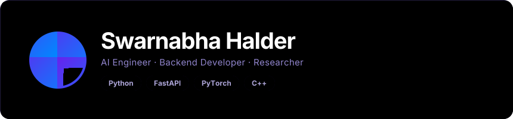

 

 

 

***

My work spans **scientific computing, distributed backend systems, medical image analysis, and modern AI infrastructure**. I enjoy turning complex research prototypes into reliable, secure, and maintainable products.

* 🎓 **Education:** M.Tech in Computer Science, Indian Statistical Institute (ISI) | B.Tech in CSE
* 🎯 **Current Focus:** Building highly available, asynchronous API architectures and enterprise-grade AI deployments.
* 🌱 **Currently Exploring:** Agentic AI, Multi-Agent Systems, RAG Pipelines, and Vector Databases.
* 💼 **Open To:** Roles in AI Engineering, Backend Architecture, and Applied Research.

***

### 🔐 PrintFlow: Secure Print Analytics and Management Platform

**Enterprise-grade analytics system with robust security architectures.**

* **Stack:** FastAPI, MySQL, Windows Event Logs
* **Highlights:** Implemented mTLS authentication and secure JWT authorization pipelines. Designed a high-performance asynchronous backend capable of scaling enterprise print telemetry data.

### 🏥 Medical Image Registration

**Advanced algorithmic pipeline for precision medical imaging.**

* **Stack:** OpenCV, Python, Scientific Computing Libraries
* **Highlights:** Engineered B-Spline and Demons registration models. Applied research to 3D reconstruction and histopathology to improve automated diagnostic accuracy.

### 🌍 CosmoCompute: Planetary Material Predictor

**Predictive modeling system for planetary materials.**

* **Stack:** PyTorch, Interactive Dashboards, Data Engineering
* **Highlights:** Processed and analyzed massive NASA datasets to build robust machine learning models for geological material prediction.

### 👁️ AuthVision

**AI-powered attendance and spoof-detection system.**

* **Stack:** TensorFlow, YOLO, FastAPI, Docker, JWT
* **Highlights:** Designed an end-to-end computer vision pipeline with integrated anti-spoofing mechanisms, containerized for rapid, scalable production deployment.

***

 
<h4 align="center">Languages</h4>

 
<h4 align="center">Backend & Frameworks</h4>

 
<h4 align="center">AI & Machine Learning</h4>

 
<h4 align="center">Cloud, Infra & Databases</h4>

 
<h4 align="center">Tooling</h4>

***

* **2026** — M.Tech CS at Indian Statistical Institute (ISI)
* **2025** — Research Internship at Indian Statistical Institute (ISI) | Planetary Material Prediction | Medical Image Registration Research
* **2024** — Backend Engineering at TechnoHacks & CodeSoft
* **2023** — Active Open Source Contributions (Hacktoberfest '23 & '24)
* **2022** — Began Open Source Journey & Competitive Programming

***

 

 

 

  

## 🤝 Let's Connect

**[Explore My Portfolio](https://swarnabha.tech/) • [Connect on LinkedIn](https://linkedin.com/in/swarnabha-halder-627692254)**

 

𝗉𝗈𝗐𝖾𝗋𝖾𝖽 𝖻𝗒 <a href="https://github.com/collectioneur/readme-aura">𝗋𝖾𝖺𝖽𝗆𝖾-𝖺𝗎𝗋𝖺</a>

